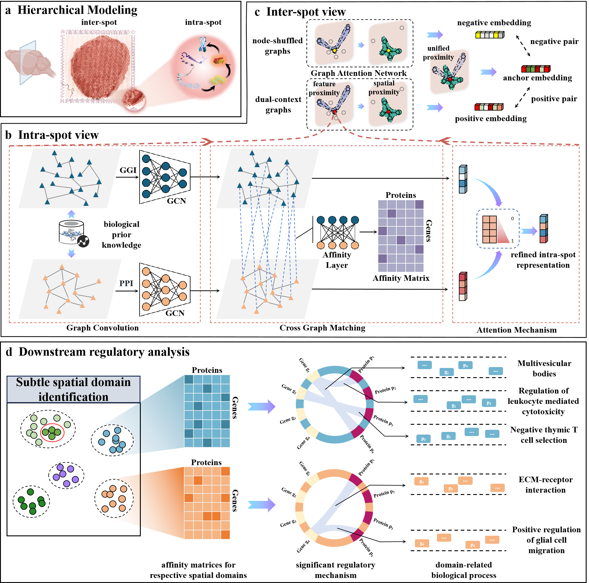

# SMOReg: Decoding Spatial Domains with Interpretable Molecular Regulatory Mechanisms via Hierarchical Graph Modeling

## Overview

SMOReg is a hierarchical graph modeling framework designed to identify spatial domains and infer molecular regulatory mechanisms in spatial multi-omics data. By integrating intra-spot and inter-spot perspectives, SMOReg refines multi-omics data through biological graph convolution networks and contrastive learning. It outperforms existing methods by revealing biologically meaningful spatial domains and uncovering context-specific regulatory relationships, making it a powerful tool for studying tissue spatial organization.




## Environment Requirements

To run this project, the following environment setup is recommended:

- **Python Version**: Python 3.8.19
- **CUDA Version**: 12.1
- **PyTorch Version**: 2.1.0+cu121
- **Operating System**: Ubuntu 24.04.1, Kernel Version: 6.14.0-34-generic
- **GPU**: Multiple NVIDIA A100-40GB GPUs (as seen from `nvidia-smi` output)

### Required Libraries

- torch-cluster==1.6.2+pt21cu121
- torch-geometric==2.5.3
- torch-scatter==2.1.2+pt21cu121
- torch-sparse==0.6.18+pt21cu121
- torch-spline-conv==1.2.2+pt21cu121
- torchmetrics==1.4.3
- scanpy==1.9.6
- scikit-learn==1.3.0
- scikit-misc==0.2.0
- scipy==1.9.3
- pandas==1.5.3
- numpy==1.23.5


Make sure your system meets these requirements to ensure proper execution of the project.


## Getting Started

To begin using the project, follow the steps below to set up the environment, configure the necessary resources, and start running experiments.

### 1. Prerequisites

Ensure that the following requirements are met:
- Python Version: 3.8.19 or later.
- CUDA Version: 12.1.
- All required dependencies are installed as per the **Environment Requirements** section above.

### 2. Dataset and Resource Setup

Before running the experiments, download the necessary datasets and configure the corresponding resource paths. For more information on the datasets, please refer to the **Data** section.

- Make sure to place these datasets in the `Data` directory within the project structure. If you are using any custom data, ensure the paths are properly configured in the respective scripts.

### 3. Environment Configuration

After setting up the dependencies and downloading the datasets, you need to configure the project environment:
- Ensure that your GPU drivers and CUDA are correctly set up to maximize computational efficiency.
- Update the configuration files in the `config` directory, if necessary, to specify the correct paths for data files and other resources.

### 4. Running the Experiments

There are two primary scripts for running experiments:

- **Main Experiment with Real Data:**

  Once the environment is set up and resources are configured, you can run the main experimental pipeline using the following command:
  ```bash
  python main_exp_data.py
  ```

- **Simulated Experiment:**

    If you'd like to test the pipeline with simulated data, use the following script:

    ```
    python main_simulate.py
    ```


### 5. GPU Resource Considerations

Please note that both the real data experiments and the simulated experiments can be computationally intensive, particularly when running on large datasets. The algorithms may take significant time to complete, depending on the complexity and the size of the dataset.

It is **highly recommended** to ensure that your system is equipped with sufficient GPU resources to handle these tasks effectively. You can monitor GPU usage during the experiment by running the command `nvidia-smi` to check for available memory and GPU utilization. If you encounter memory issues, consider running the experiments on a machine with more GPU memory.

### 6. Troubleshooting

If you encounter any issues during the setup or execution, feel free to open an issue in the repository for further assistance.


## Data

The spatial multi-omics datasets used in this study are publicly available from various sources. The human lymph node dataset (GSE263617) is available at [NCBI GEO](https://www.ncbi.nlm.nih.gov/geo/query/acc.cgi?acc=GSE263617). The human tonsil dataset (GSE213264), profiled using spatial-CITE-seq, can be accessed at [NCBI GEO](https://www.ncbi.nlm.nih.gov/geo/query/acc.cgi?acc=GSE213264). A high-resolution microscope image of a human tonsil sample is available at [Figshare](https://doi.org/10.6084/m9.figshare.20723680). The mouse thymus dataset was collected from BGI Genomics using the Stereo-CITE-seq technology.